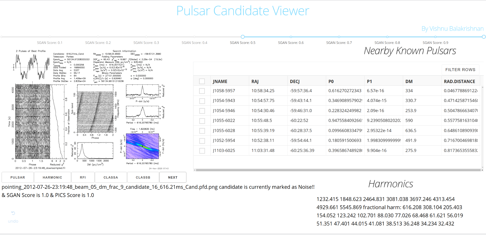

Pulsar Candidate GUI built using DASH (https://plotly.com/dash/).

This helps users view and classify pulsar candidates into different categories like **Pulsars**, **Non-Pulsars**, **RFI**, **Noise**, or **Class A/B Candidates**. Your classification is stored in a csv file that can be later used to re-train a Machine Learning Model. Includes a nearby 'known pulsar' table.

